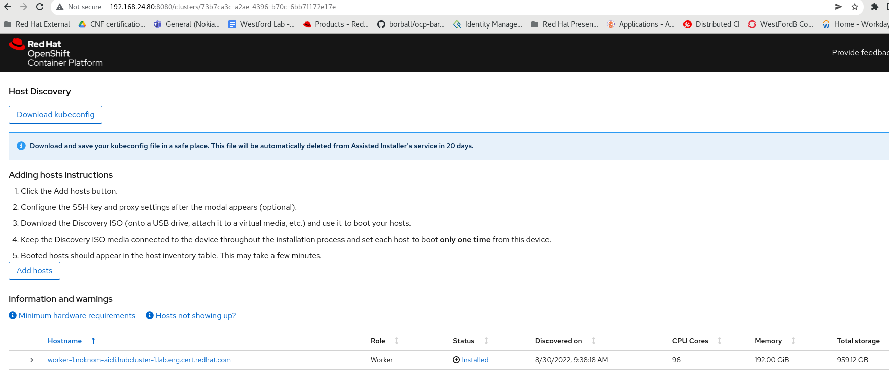

Table of Contents
=================

* [Table of Contents](#table-of-contents)
* [how-to-import-ocp-cluster-add-worker-ai](#how-to-import-ocp-cluster-add-worker-ai)
   * [Purpose](#purpose)
   * [Pre-requites](#pre-requites)
   * [Prepare to import Openshift Cluster](#prepare-to-import-openshift-cluster)
      * [Prepare the deployment by setting the environment variables](#prepare-the-deployment-by-setting-the-environment-variables)
         * [Setup aicli alias](#setup-aicli-alias)
         * [An API URL to Offline Assisted-Installer](#an-api-url-to-offline-assisted-installer)
         * [Image Pull Secret](#image-pull-secret)
         * [Offline Token](#offline-token)
         * [JWT Token](#jwt-token)
         * [Set ENV for Cluster Name, Base-domain and Existed OCP Cluster-ID](#set-env-for-cluster-name-base-domain-and-existed-ocp-cluster-id)
         * [Start Import Openshift Cluster](#start-import-openshift-cluster)
      * [Prepare to create InfraENV CFG](#prepare-to-create-infraenv-cfg)
         * [Set Environment for New Cluster-ID](#set-environment-for-new-cluster-id)
         * [Setup/Prepare InfraENV Json for new worker host](#setupprepare-infraenv-json-for-new-worker-host)
         * [Start Create InfraEnv](#start-create-infraenv)
   * [Prepare to generate ISO file for new worker node](#prepare-to-generate-iso-file-for-new-worker-node)
      * [Prepare NMState static configuration for new host](#prepare-nmstate-static-configuration-for-new-host)
      * [Create ISO File Using aicli with static_config](#create-iso-file-using-aicli-with-static_config)
      * [Download ISO file](#download-iso-file)
      * [Copy ISO file to your laptop and boot](#copy-iso-file-to-your-laptop-and-boot)
      * [Observe the boot activities from iLO or Bios-Console](#observe-the-boot-activities-from-ilo-or-bios-console)
      * [Start the new host/worker node Installation](#start-the-new-hostworker-node-installation)
      * [Approve CSR for new worker/host to join existing OpenShift Cluster](#approve-csr-for-new-workerhost-to-join-existing-openshift-cluster)
      * [Check new worker/host status](#check-new-workerhost-status)
      * [Assisted-Installed GUI Status](#assisted-installed-gui-status)
  
# how-to-import-ocp-cluster-add-worker-ai
The idea is to show how to import an OpenShift Running Cluster to new Assisted-Installer then add a worker node to this imported cluster
## Purpose
The  of this repo is to show how to import an Openshift cluster to Offline/Standard-alone Assisted-Installer using REST API (curl) to AI.
Once OCP Cluster is successfully imported to AI, then prepare and add a new worker node to it using aicli.

When the node boots with that ISO, the node automatically reaches out to the existing cluster, the result it causes two CertificateSigningRequests (CSRs) to be sent from the new node to the existing cluster. A CSR is simply a request to obtain the client certificates for the (existing) cluster. You'll need to explicitly approve these requests. Once approved, the existing cluster provides the client certificates to the new node, and the new node is allowed to join the existing cluster. 

From AI GUI status, it only shows new worker host but not the imported cluster, and green checked wont be possible at current AI version (installed status). With oc cmd all old and new hosts are visible as normally.
  
**Note**: using aicli to prepare and set static IP for new worker node


## Pre-requites
- **latest aicli tool**  
  https://aicli.readthedocs.io/en/latest/
```bash
python way:
sudo pip3 install -U aicli
sudo pip3 install -U assisted-service-client

Container's way:
alias aicli='sudo podman run --rm -e AI_URL=${AI_URL_EP} -e AI_OFFLINETOKEN=${TOKEN} -v ${HOME}/.ssh/:/root/.ssh/:Z -v $HOME/noknom-aicli/:/root/.aicli:Z -v ${HOME}/noknom-aicli/:/workdir:Z quay.io/karmab/aicli:latest'
```
- **An Offline Assisted-Installer**
- **Either Existed/Running OCP Cluster(SNO or Compact Cluster)**
- **Offline Token that can get from here**  
    https://console.redhat.com/openshift/token/show#
- **Public SSH-Key for core user ssh**
- ** Image Pull Secret**  
  https://console.redhat.com/openshift/install/pull-secret
  
## Prepare to import Openshift Cluster
### Prepare the deployment by setting the environment variables
#### Setup aicli alias 
```
alias aicli="aicli --offlinetoken $OFFLINE_TOKEN -U $API_URL"
```
#### An API URL to Offline Assisted-Installer
```
export API_URL=192.168.24.80:8080
```
#### Image Pull Secret
```
export PULL_SECRET=$(sed '/^[[:space:]]*$/d' openshift_pull.json| jq -R .)
```
#### Offline Token
```
export OFFLINE_TOKEN='xxxxxxxxxxxxxxxxxxxxxxxxxxxxx'
```
#### JWT Token 
```
export TOKEN=$(curl --silent --data-urlencode "grant_type=refresh_token" --data-urlencode "client_id=cloud-services" --data-urlencode "refresh_token=${OFFLINE_TOKEN}" https://sso.redhat.com/auth/realms/redhat-external/protocol/openid-connect/token | jq -r .access_token)
```
#### Set ENV for Cluster Name, Base-domain and Existed OCP Cluster-ID
```
export CLUSTER_NAME='noknom-aicli'
export CLUSTER_DOMAIN='hubcluster-1.lab.eng.cert.redhat.com'
export OS_CLUSTER_ID=$(oc get clusterversion -o jsonpath='{.items[].spec.clusterID}{"\n"}')
```
#### Start Import Openshift Cluster
```bash
curl -X POST  "$API_URL/api/assisted-install/v2/clusters/import" -H "accept: application/json" -H "Content-Type: application/json" -H "Authorization: Bearer $TOKEN" -d "{\"name\":\"$CLUSTER_NAME\",\"openshift_cluster_id\":\"$OS_CLUSTER_ID\",\"api_vip_dnsname\":\"api.$CLUSTER_NAME.$CLUSTER_DOMAIN\"}"
```
### Prepare to create InfraENV CFG
#### Set Environment for New Cluster-ID
```
NEW_CLUSTER_ID=$(aicli list cluster|grep $CLUSTER_NAME |awk '{print $4}')
```
#### Setup/Prepare InfraENV Json for new worker host
```bash
cat << EOF > ./infra-envs-addhost.json
{
  "name": "noknom-aicli",
  "ssh_authorized_key": "$(cat /root/noknom-aicli/.aicli/jumphost-ssh)",
  "pull_secret": $PULL_SECRET,
  "cluster_id": "$NEW_CLUSTER_ID",
  "openshift_version": "4.10",
  "image_type": "minimal-iso",
  "base_dns_domain": "$CLUSTER_DOMAIN"
}
EOF
```
#### Start Create InfraEnv
```
curl -X POST "$API_URL/api/assisted-install/v2/infra-envs" -H "accept: application/json" -H "Content-Type: application/json" -H "Authorization: Bearer $TOKEN" -d @infra-envs-addhost.json
```
- **Output:**
```json
{
   "cluster_id":"73b7ca3c-a2ae-4396-b70c-6bb7f172e17e",
   "cpu_architecture":"x86_64",
   "created_at":"2022-08-30T14:27:48.275356Z",
   "download_url":"http://192.168.24.80:8888/images/df3d5eb2-c1b8-4692-be70-d529c2bb28d1?arch=x86_64&type=minimal-iso&version=4.10",
   "email_domain":"Unknown",
   "expires_at":"0001-01-01T00:00:00.000Z",
   "href":"/api/assisted-install/v2/infra-envs/df3d5eb2-c1b8-4692-be70-d529c2bb28d1",
   "id":"df3d5eb2-c1b8-4692-be70-d529c2bb28d1",
   "kind":"InfraEnv",
   "name":"noknom-aicli",
   "openshift_version":"4.10",
   "proxy":{
      
   },
   "pull_secret_set":true,
   "ssh_authorized_key":"ssh-rsa yyyyyyyyyyyyyyyyyyyyyyyyyyyyyyyyyyyyyyyyyyyyyyyyyyyyyyyyyyyyyyyyyyyyyyyyyyyyyyyyyyyyyyyyyyyyyyyyyyy",
   "type":"minimal-iso",
   "updated_at":"2022-08-30T14:27:48.277593Z",
   "user_name":"admin"
}
```
## Prepare to generate ISO file for new worker node
### Prepare NMState static configuration for new host
```yaml
static_network_config:
- interfaces:
    - name: eno1
      description: SSH interface and Data/Cluster network configuration of worker-1
      type: ethernet
      state: up
      ipv4:
        address:
        - ip: 192.168.24.90
          prefix-length: 25
        enabled: true
      mac-address: b8:ce:f6:56:48:xx
  dns-resolver:
    config:
      server:
      - 192.168.24.80
  routes:
    config:
    - destination: 0.0.0.0/0
      next-hop-address: 192.168.24.1
      next-hop-interface: eno1
```
### Create ISO File Using aicli with static_config
```
aicli create iso -m --paramfile noknom-aicli-worker-1.yaml noknom-aicli
Getting Iso url for infraenv noknom-aicli
http://192.168.24.80:8888/images/df3d5eb2-c1b8-4692-be70-d529c2bb28d1?arch=x86_64&type=minimal-iso&version=4.10
```
### Download ISO file 
```
aicli download iso -p ./ noknom-aicli
Downloading Iso for infraenv noknom-aicli in ./
```
### Copy ISO file to your laptop and boot 
- Copy to ISO to your laptop
- set boot order to Virtual-CD/DVD and Checked
- Attach ISO file to virtual-connect

### Observe the boot activities from iLO or Bios-Console
- It will be at least 2-3 reboot after seen ostree-0 and ostrees-1 
- After First Reboot, new host is already discovered
- Cluster View-Events to watch for any dns issue if new is not in Ready State

### Start the new host/worker node Installation
- Once new host is discovered, it can be started using aicli or AI GUI button
```
aicli list host
+------------------------------------------------------------+--------------------------------------+--------------+--------------+--------------+--------+---------------+
|                            Host                            |                  Id                  |   Cluster    |   Infraenv   |    Status    |  Role  |       Ip      |
+------------------------------------------------------------+--------------------------------------+--------------+--------------+--------------+--------+---------------+
| worker-1.noknom-aicli.hubcluster-1.lab.eng.cert.redhat.com | e0d004d2-a73f-470a-287e-d90ddcc2a4a3 | noknom-aicli | noknom-aicli | insufficient | worker | 192.168.24.90 |
+------------------------------------------------------------+--------------------------------------+--------------+--------------+--------------+-------
aicli start hosts worker-1.noknom-aicli.hubcluster-1.lab.eng.cert.redhat.com
Installing Host worker-1.noknom-aicli.hubcluster-1.lab.eng.cert.redhat.com
```
```
aicli list host
+------------------------------------------------------------+--------------------------------------+--------------+--------------+------------------------+--------+---------------+
|                            Host                            |                  Id                  |   Cluster    |   Infraenv   |         Status         |  Role  |       Ip      |
+------------------------------------------------------------+--------------------------------------+--------------+--------------+------------------------+--------+---------------+
| worker-1.noknom-aicli.hubcluster-1.lab.eng.cert.redhat.com | e0d004d2-a73f-470a-287e-d90ddcc2a4a3 | noknom-aicli | noknom-aicli | installing-in-progress | worker | 192.168.24.90 |
+------------------------------------------------------------+--------------------------------------+--------------+--------------+----------------------
```
### Approve CSR for new worker/host to join existing OpenShift Cluster
```
oc get csr -A
NAME        AGE   SIGNERNAME                                    REQUESTOR                                                                   REQUESTEDDURATION   CONDITION
csr-9tjfz   0s    kubernetes.io/kubelet-serving                 system:node:worker-1.noknom-aicli.hubcluster-1.lab.eng.cert.redhat.com      <none>              Pending
csr-w2vzj   59s   kubernetes.io/kube-apiserver-client-kubelet   system:serviceaccount:openshift-machine-config-operator:node-bootstrapper   <none>              Pending
```
```
oc get csr -o name | xargs oc adm certificate approve
certificatesigningrequest.certificates.k8s.io/csr-9tjfz approved
certificatesigningrequest.certificates.k8s.io/csr-w2vzj approved
```
### Check new worker/host status
<details>
 <summary><b>Click Here to see overall Cluster and New worker host Status</b></summary>

```
oc get no 
NAME                                                         STATUS   ROLES           AGE     VERSION
master-0.noknom-aicli.hubcluster-1.lab.eng.cert.redhat.com   Ready    master,worker   5d      v1.23.5+012e945
master-1.noknom-aicli.hubcluster-1.lab.eng.cert.redhat.com   Ready    master,worker   4d18h   v1.23.5+012e945
master-2.noknom-aicli.hubcluster-1.lab.eng.cert.redhat.com   Ready    master,worker   5d      v1.23.5+012e945
worker-0.noknom-aicli.hubcluster-1.lab.eng.cert.redhat.com   Ready    worker          3d19h   v1.23.5+012e945
worker-1.noknom-aicli.hubcluster-1.lab.eng.cert.redhat.com   Ready    worker          44s     v1.23.5+012e945
oc get co
NAME                                       VERSION   AVAILABLE   PROGRESSING   DEGRADED   SINCE   MESSAGE
authentication                             4.10.23   True        False         False      4d18h   
baremetal                                  4.10.23   True        False         False      5d      
cloud-controller-manager                   4.10.23   True        False         False      5d      
cloud-credential                           4.10.23   True        False         False      5d      
cluster-autoscaler                         4.10.23   True        False         False      5d      
config-operator                            4.10.23   True        False         False      5d      
console                                    4.10.23   True        False         False      4d19h   
csi-snapshot-controller                    4.10.23   True        False         False      3d18h   
dns                                        4.10.23   True        False         False      5d      
etcd                                       4.10.23   True        False         False      5d      
image-registry                             4.10.23   True        False         False      5d      
ingress                                    4.10.23   True        False         False      5d      
insights                                   4.10.23   True        False         False      5d      
kube-apiserver                             4.10.23   True        False         False      5d      
kube-controller-manager                    4.10.23   True        False         False      5d      
kube-scheduler                             4.10.23   True        False         False      5d      
kube-storage-version-migrator              4.10.23   True        False         False      3d18h   
machine-api                                4.10.23   True        False         False      5d      
machine-approver                           4.10.23   True        False         False      5d      
machine-config                             4.10.23   True        False         False      5d      
marketplace                                4.10.23   True        False         False      5d      
monitoring                                 4.10.23   True        False         False      5d      
network                                    4.10.23   True        False         False      5d      
node-tuning                                4.10.23   True        False         False      3d18h   
openshift-apiserver                        4.10.23   True        False         False      4d19h   
openshift-controller-manager               4.10.23   True        False         False      5d      
openshift-samples                          4.10.23   True        False         False      3d18h   
operator-lifecycle-manager                 4.10.23   True        False         False      5d      
operator-lifecycle-manager-catalog         4.10.23   True        False         False      5d      
operator-lifecycle-manager-packageserver   4.10.23   True        False         False      4d23h   
service-ca                                 4.10.23   True        False         False      5d      
storage                                    4.10.23   True        False         False      5d      

oc get clusterversion
NAME      VERSION   AVAILABLE   PROGRESSING   SINCE   STATUS
version   4.10.23   True        False         3d18h   Cluster version is 4.10.23

oc get bmh -A
NAMESPACE               NAME                                                         STATE       CONSUMER                      ONLINE   ERROR   AGE
openshift-machine-api   master-0.noknom-aicli.hubcluster-1.lab.eng.cert.redhat.com   unmanaged   noknom-aicli-tn482-master-0   true             5d1h
openshift-machine-api   master-1.noknom-aicli.hubcluster-1.lab.eng.cert.redhat.com   unmanaged   noknom-aicli-tn482-master-1   true             4d19h
openshift-machine-api   master-2.noknom-aicli.hubcluster-1.lab.eng.cert.redhat.com   unmanaged   noknom-aicli-tn482-master-2   true             5d1h

oc get machine -A
NAMESPACE               NAME                          PHASE     TYPE   REGION   ZONE   AGE
openshift-machine-api   noknom-aicli-tn482-master-0   Running                          5d1h
openshift-machine-api   noknom-aicli-tn482-master-1   Running                          4d19h
openshift-machine-api   noknom-aicli-tn482-master-2   Running                          5d1h

oc get mcp
NAME     CONFIG                                             UPDATED   UPDATING   DEGRADED   MACHINECOUNT   READYMACHINECOUNT   UPDATEDMACHINECOUNT   DEGRADEDMACHINECOUNT   AGE
master   rendered-master-29e79b753b89e86e66c3fbcee6daf0b7   True      False      False      3              3                   3                     0                      5d
worker   rendered-worker-063a9d5c28619d6d4ee9b60a689a75d3   True      False      False      2              2                   2                     0                      5d

oc get mcv
NAME           HUB ACCEPTED   MANAGED CLUSTER URLS                                                 JOINED   AVAILABLE   AGE
noknom-aicli   true           https://api.noknom-aicli.hubcluster-1.lab.eng.cert.redhat.com:6443   True     True        3d18h
```
</details>

### Assisted-Installed GUI Status
- As you can see the Installed status is unchecked-green but that is how it works for now.  
  All the existed cluster and new host's components are healthy!

